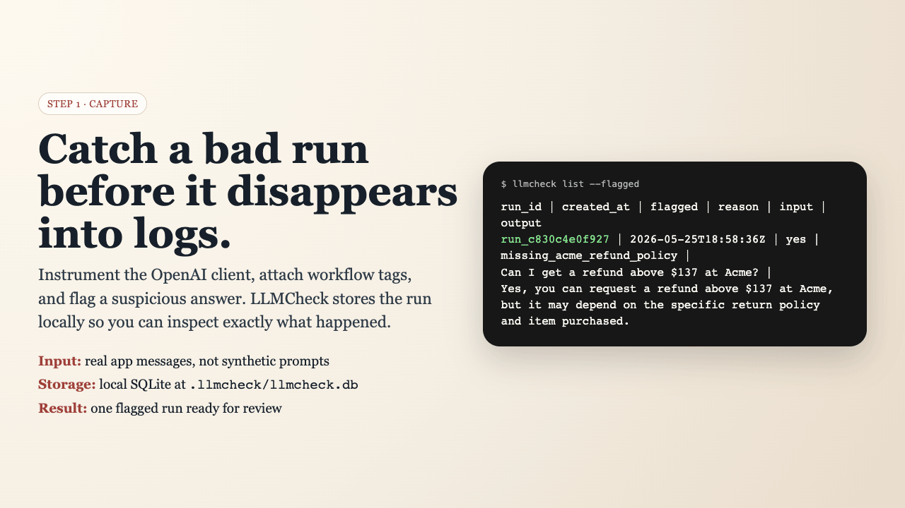

# LLMCheck

Capture a bad LLM response, review what should have happened, and turn it into a regression case you can rerun.

LLMCheck is a Python tool with local SQLite storage, reviewed YAML cases, and a command-line suite runner. It wraps synchronous OpenAI chat-completions calls. A separate experimental workflow supports reviewed knowledge reuse.

**Release status:** 0.4.0 candidate. Source checkout, wheel and source-distribution installation are supported. This README does not imply a published PyPI release. Licensed under Apache-2.0; see [License](#license).

## Try the synthetic demo

After installing from a checkout or built wheel:

```bash
python -m llmcheck.web_demo
```

Open the address printed by the command. The demo lets you select fixed synthetic cases and inspect locally calculated verdicts through a read-only interface. It needs no API key, accepts no private application data, and does not evaluate your application. It is separate from the pilot dashboard, which reads a local workspace. Try the [hosted demo](https://llmcheck-demo.onrender.com). It includes a clearly labelled recorded OpenAI evaluation alongside the literal fixture judge. Render’s free instance may take time to wake after inactivity.



## Article examples

Browse the [article reproduction scripts and instructions](examples/article/README.md) directly in this repository. They include the offline capture/review/replay demo, result inspector, twelve-case experiment and gate probes. Use the documented historical checkout to reproduce the article figures; no separate ZIP is needed. The [interactive case explorer](https://llmcheck-demo.onrender.com/#explorer) lets you inspect the twelve synthetic cases in your browser.

## Install

Python 3.10 or later is required. Start in a virtual environment:

```bash
git clone --branch main https://github.com/nextwebb/llmcheck.git
cd llmcheck
python3 -m venv .venv
source .venv/bin/activate
python -m pip install .
llmcheck --help
```

The checkout command installs the revision you cloned. Pin a reviewed commit or tag for reproducible deployments. Install `openai` separately if your application uses the OpenAI SDK; configure `OPENAI_API_KEY` through your normal secret-management process for live calls and the default judge.

To build and install portable distributions locally:

```bash
python -m pip install build
python -m build
python -m pip install dist/llmcheck-0.4.0-py3-none-any.whl
```

The source distribution is `dist/llmcheck-0.4.0.tar.gz` and can also be installed with pip. Regular wheels contain the package files; editable installs are reserved for development.

## Capture, review, replay

Initialize a workspace:

```bash
llmcheck init
```

Instrument your application's client and attach the context you want recorded:

```python
from openai import OpenAI
from llmcheck import instrument_openai, add_context, add_tags, flag

client = instrument_openai(OpenAI())
policy = "Refunds above $100 need manager approval and take 3-5 business days."
add_context([{"id": "refund-policy", "text": policy}])
add_tags({"workflow": "refund-support"})
response = client.chat.completions.create(
    model="gpt-4o-mini",
    messages=[
        {"role": "system", "content": policy},
        {"role": "user", "content": "Can my $150 refund arrive today?"},
    ],
)
# After inspecting an incorrect response, record a specific reason:
# flag("Response promised immediate payment without the required approval.")
```

This example makes a live provider call and may incur charges. `add_context` stores evidence; the explicit system message supplies the policy to the application. Capture occurs after a successful call. Do not use substring matches as proof that an answer violates a policy.

Inspect and review the captured output:

```bash
llmcheck list
llmcheck review --latest
```

Review the generated YAML before approving it. Drafts preserve your correction in the rubric and leave required/forbidden lists empty for you to fill. Check each required fact, forbidden claim and rubric. Then configure the suite's `runner.callable` to point to your application adapter:

```yaml
runner:
  type: python
  callable: application_adapter:answer_user
```

The runner calls that synchronous function with the case inputs as keyword arguments and judges its returned text. Empty suites fail instead of reporting a vacuous pass:

```bash
llmcheck run-suite -c llmcheck.yaml --suite llmcheck_suite.yaml
```

Replay executes Python code and can repeat its side effects. Use a controlled application environment. The default judge sends the case material and fresh output to OpenAI. A passing verdict means the judge reported no violations under the case's criteria, not proof that the answer or downstream actions are correct.

## Scope and limits

- Capture: synchronous `client.chat.completions.create(...)`; not every provider, streaming response or asynchronous SDK path.
- Storage: local SQLite and files. Treat prompts, outputs and retained context as sensitive.
- Evaluation: reviewed criteria, fresh callable execution and structured judge reports. Judge mistakes remain possible.
- Knowledge reuse: experimental, workflow-scoped matching can add approved context to later requests. It is not a demonstrated reduction in production failures.
- Hosting: the synthetic demo is read-only. The local workspace dashboard is not a multi-user service or a safe substitute for authentication.

See the [API and workflow reference](docs/reference.md) for storage schemas, CLI commands, suite details and the knowledge pilot. See [security guidance](SECURITY.md) before using real application data.

## Development

```bash
python -m pip install -e '.[test]'
pytest -q
```

[Contributing](CONTRIBUTING.md) explains verification and packaging. [Changelog](CHANGELOG.md) records the candidate changes. Source and issue tracking: [github.com/nextwebb/llmcheck](https://github.com/nextwebb/llmcheck).

## License

Copyright 2026 Peterson Oaikhenah. Licensed under the [Apache License, Version 2.0](LICENSE). See [NOTICE](NOTICE) for attribution.
